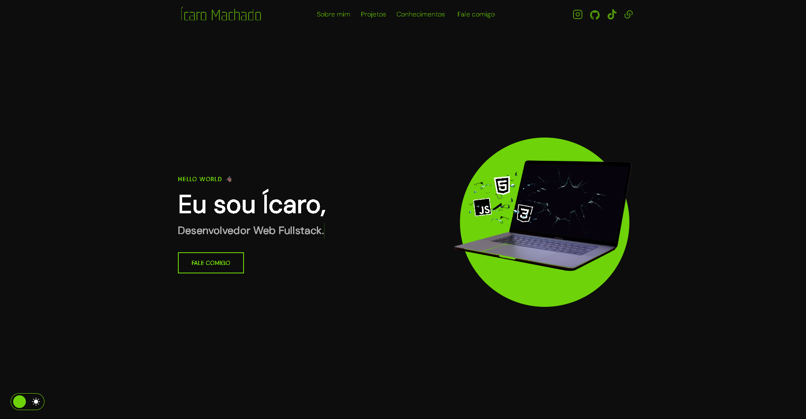

# 🔗 Links Pessoais - Portfólio

[](https://icarox52.github.io/PortfolioNovo/)
[](https://github.com/Icarox52/PortfolioNovo/stargazers)

<a href="https://icarox52.github.io/PortfolioNovo/"></a>

Portfólio desenvolvido com HTML, CSS e JavaScript, garantindo design responsivo e performance otimizada para todos os dispositivos. Código semântico e focado na experiência do usuário.

## ✨ Funcionalidades

<ul>
  <li>✨ <strong>Apresentação Impactante</strong> - Seção hero com efeito typewriter</li>
  <li>✍️ <strong>Navegação Intuitiva</strong> - Menu fixo com rolagem suave</li>
  <li>🌗 <strong>Tema Personalizável</strong> - Alterna entre light/dark mode</li>
  <li>📱 <strong>Mobile-First</strong> - Design responsivo para todos os dispositivos</li>
  <li>⚡ <strong>Otimizado</strong> - Carregamento ultrarrápido e SEO básico</li>
  <li>🎨 <strong>Interações Dinâmicas</strong> - Hover effects e microanimações</li>
  <li>🔗 <strong>CTA Estratégicos</strong> - Botões de contato e redes sociais</li>
  <li>🔄 <strong>Carrossel de Projetos</strong> - Galeria interativa com navegação</li>
</ul>

## 🛠️ Tecnologias Utilizadas

| Tecnologia | Função |
|------------|--------|
|  **HTML5** | Estrutura semântica da página |
|  **CSS3** | Responsividade, animações, dark mode |
|  **JavaScript** | Lógica e interatividade |

## 🚀 Como Usar

1. Acesse o site online: [Links](https://icarox52.github.io/LinksIcaro3/)
2. Ou clone localmente:
```bash
git clone https://github.com/Icarox52/LinksIcaro3.git
```

## 📌 Contato

Gostou do projeto? Me siga no GitHub para mais conteúdos incríveis!

[](https://github.com/Icarox52)

---

Desenvolvido com ❤️ por **Icarox52** usando as melhores tecnologias web. 🚀
